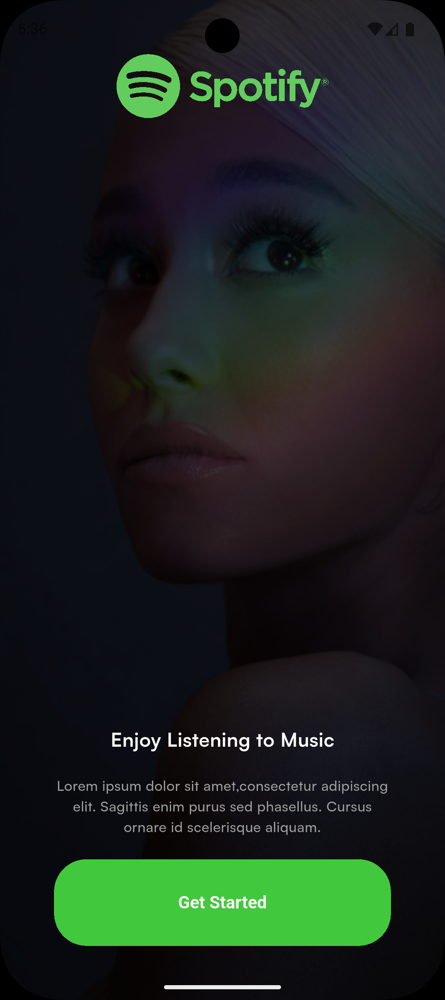
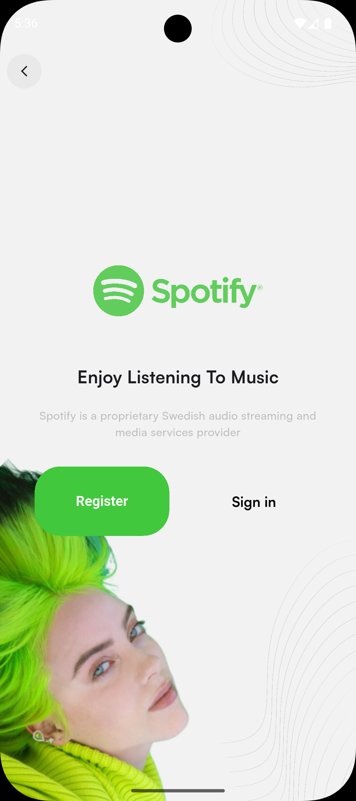
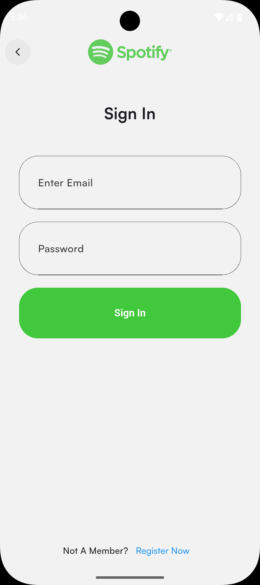
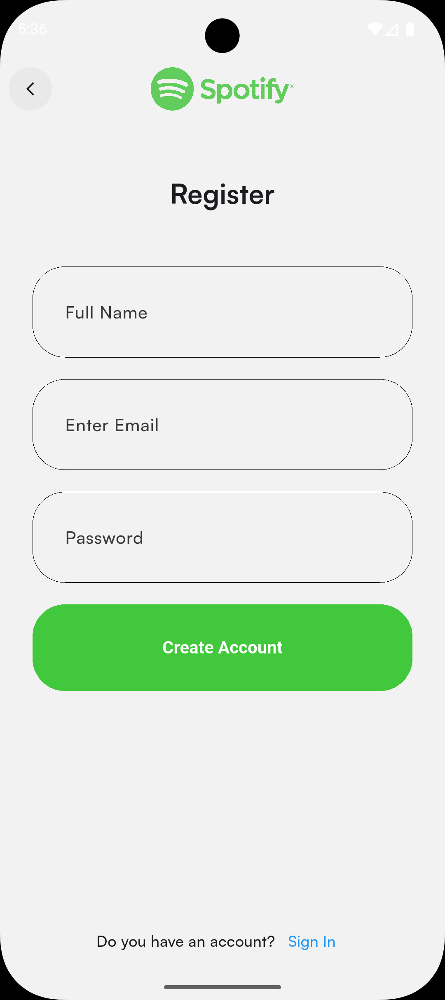
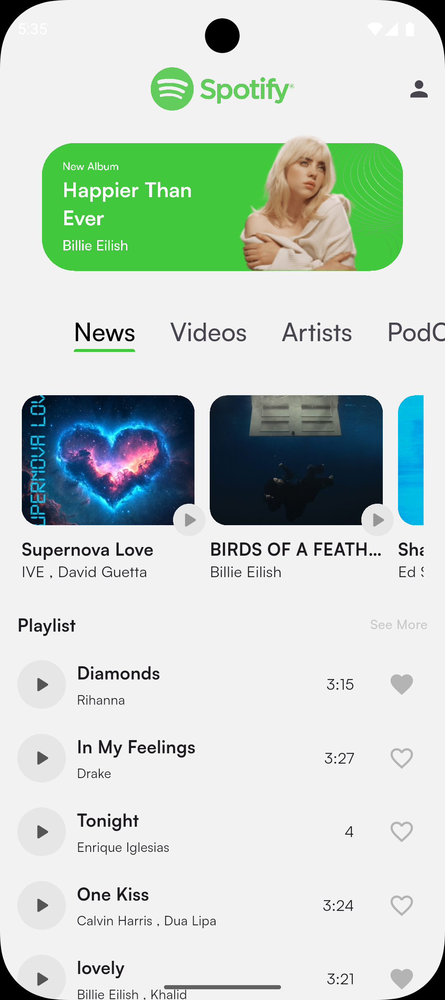
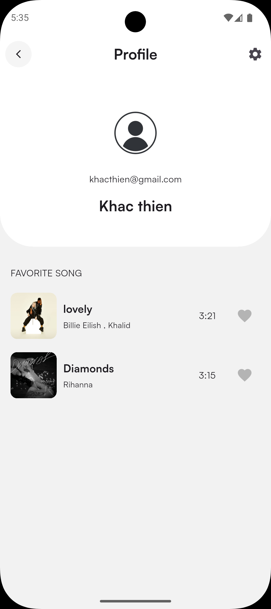
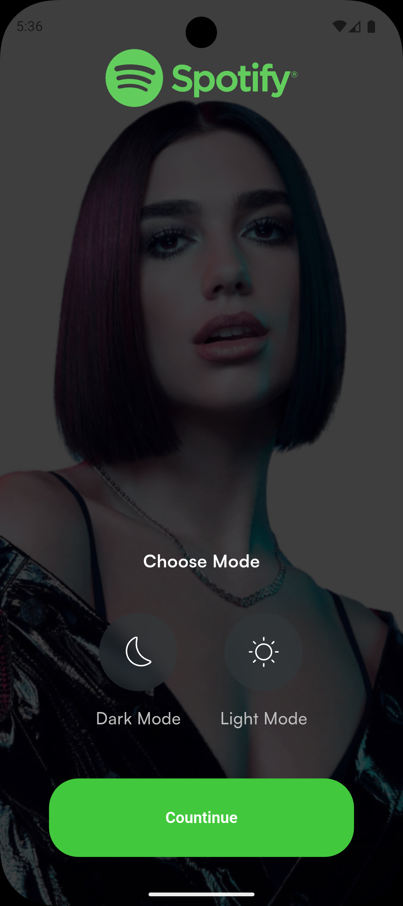

# Sporifyyy Music App 🎵

A modern music streaming application built with Flutter, featuring user authentication, music playback, favorites management, and theme customization.

## 📱 Screenshots

### Authentication Flow
<table>
  <tr>
    <td align="center">
      
      <br />
      <b>Welcome Screen</b>
    </td>
    <td align="center">
      
      <br />
      <b>Authentication Options</b>
    </td>
    <td align="center">
      
      <br />
      <b>Login</b>
    </td>
    <td align="center">
      
      <br />
      <b>Register</b>
    </td>
  </tr>
</table>

### Main Features
<table>
  <tr>
    <td align="center">
      
      <br />
      <b>Home Screen</b>
    </td>
    <td align="center">
      
      <br />
      <b>Music Player</b>
    </td>
    <td align="center">
      
      <br />
      <b>Profile & Favorites</b>
    </td>
    <td align="center">
      
      <br />
      <b>Theme Selection</b>
    </td>
  </tr>
</table>

## ✨ Features

### 🔐 Authentication
- **Firebase Authentication** integration
- Email and password login/registration
- User profile management
- Secure authentication flow

### 🎵 Music Playback
- Stream music from Firebase Cloud Firestore
- Full-featured music player with controls
- Background audio playback support
- Track progress and duration display
- Play, pause, skip controls

### ❤️ Favorites Management
- Add songs to favorites
- View and manage favorite songs
- Persistent favorites storage
- Quick access from profile

### 🎨 Theme Customization
- Light and Dark mode support
- Smooth theme transitions
- Persistent theme preference
- Material Design UI

### 👤 User Profile
- View user information
- Access settings
- Manage favorite songs
- Profile customization options

## 🛠️ Tech Stack

- **Framework:** Flutter 3.5.3
- **State Management:** flutter_bloc, hydrated_bloc
- **Backend:** Firebase (Authentication, Firestore)
- **Audio Playback:** just_audio
- **Local Storage:** shared_preferences, path_provider
- **Authentication:** local_auth (biometric support)
- **UI:** flutter_svg for vector graphics
- **Architecture:** Clean Architecture with BLoC pattern

## 📦 Key Dependencies

```yaml
dependencies:
  flutter_bloc: ^latest
  hydrated_bloc: ^latest
  firebase_core: ^latest
  firebase_auth: ^latest
  cloud_firestore: ^latest
  just_audio: ^latest
  local_auth: ^2.3.0
  shared_preferences: ^2.3.3
  get_it: ^latest
  dartz: ^latest
```

## 🏗️ Project Structure

```
lib/
├── common/              # Shared widgets and helpers
│   ├── bloc/           # Common BLoC components
│   ├── helpers/        # Utility functions
│   └── widgets/        # Reusable widgets
├── core/               # Core configurations
│   ├── configs/        # App configurations (theme, assets)
│   └── usecases/       # Base use case classes
├── data/               # Data layer
│   ├── models/         # Data models
│   ├── repository/     # Repository implementations
│   └── sources/        # Data sources (remote/local)
├── domain/             # Domain layer
│   ├── entities/       # Business entities
│   ├── repository/     # Repository interfaces
│   └── usercases/      # Business logic use cases
└── presentation/       # Presentation layer
    ├── auth/           # Authentication screens
    ├── choose_mode/    # Theme selection
    ├── home/           # Home screen
    ├── intro/          # Onboarding screens
    ├── profile/        # User profile
    ├── settings/       # App settings
    ├── song_player/    # Music player
    └── splash/         # Splash screen
```

## 🚀 Getting Started

### Prerequisites

- Flutter SDK (3.5.3 or higher)
- Dart SDK
- Firebase project setup
- iOS/Android development environment

### Installation

1. **Clone the repository**
   ```bash
   git clone https://github.com/kh-thien/sporifyyy_music_app.git
   cd sporifyyy_music_app
   ```

2. **Install dependencies**
   ```bash
   flutter pub get
   ```

3. **Firebase Setup** ⚠️
   
   **IMPORTANT: Firebase configuration files are NOT included in this repository for security reasons.**
   
   You must set up your own Firebase project:
   
   - Create a Firebase project at [Firebase Console](https://console.firebase.google.com)
   - Enable **Authentication** (Email/Password)
   - Enable **Cloud Firestore**
   - Download configuration files:
     - **Android**: Download `google-services.json` and place it in `android/app/`
     - **iOS**: Download `GoogleService-Info.plist` and place it in `ios/Runner/`
     - **macOS**: Download `GoogleService-Info.plist` and place it in `macos/Runner/`
   
   - Generate `lib/firebase_options.dart` using FlutterFire CLI:
     ```bash
     # Install FlutterFire CLI
     dart pub global activate flutterfire_cli
     
     # Configure Firebase for your project
     flutterfire configure
     ```
   
   - **Security Best Practices**:
     - ✅ These files are already in `.gitignore`
     - ✅ Never commit API keys to version control
     - ✅ Add API key restrictions in [Google Cloud Console](https://console.cloud.google.com)
     - ✅ Restrict API keys to your app's package name/bundle ID
     - ✅ Enable only necessary APIs

4. **Run the app**
   ```bash
   flutter run
   ```

## 🔒 Security Notes

### ⚠️ IMPORTANT: API Key Protection

This repository does NOT include Firebase configuration files for security reasons:
- `android/app/google-services.json`
- `ios/Runner/GoogleService-Info.plist`
- `macos/Runner/GoogleService-Info.plist`
- `lib/firebase_options.dart`

**Never commit these files to version control!** They contain sensitive API keys that could be exploited if exposed publicly.

### Setting Up API Key Restrictions

After creating your Firebase project, protect your API keys:

1. Go to [Google Cloud Console](https://console.cloud.google.com)
2. Select your project
3. Navigate to **APIs & Services** → **Credentials**
4. For each API key, click **Edit**
5. Add **Application restrictions**:
   - **Android**: Add your app's SHA-1 fingerprint and package name
   - **iOS**: Add your app's bundle identifier
6. Add **API restrictions**: Enable only required APIs
7. Save changes

## 🔧 Configuration

### Firebase Firestore Structure

```
users/
  └── {userId}/
      ├── name: String
      ├── email: String
      └── favorites: Array<String>

songs/
  └── {songId}/
      ├── title: String
      ├── artist: String
      ├── duration: Number
      ├── url: String
      └── coverUrl: String
```

### Theme Configuration

The app supports both light and dark themes with custom color schemes defined in `lib/core/configs/theme/app_theme.dart`.

## 📱 Platform Support

- ✅ Android (API 23+)
- ✅ iOS (15.0+)
- ✅ Web (experimental)
- ⏳ macOS (in progress)
- ⏳ Windows (in progress)
- ⏳ Linux (in progress)

## 🧪 Testing

Run tests with:
```bash
flutter test
```

## 📄 License

This project is licensed under the MIT License - see the LICENSE file for details.

## 👨‍💻 Author

**Thien Nguyen**
- GitHub: [@kh-thien](https://github.com/kh-thien)

## 🤝 Contributing

Contributions, issues, and feature requests are welcome! Feel free to check the issues page.

**Important for Contributors:**
- Never commit Firebase configuration files
- Always add API keys to `.gitignore`
- Follow security best practices
- Test with your own Firebase project

## 📝 Development Notes

### Recent Updates (December 2025)

- ✅ Updated to Firebase SDK 12.4.0
- ✅ Updated Android Gradle Plugin to 8.7.2
- ✅ Updated iOS deployment target to 15.0
- ✅ Fixed HydratedBloc storage initialization
- ✅ Improved build performance and compatibility
- ✅ Enhanced security by removing sensitive files from git history

### Known Issues

- Background playback may require additional permissions on some devices
- Theme persistence requires app restart on some platforms

## 🙏 Acknowledgments

- Flutter team for the amazing framework
- Firebase for backend services
- Community contributors and package maintainers

---

**⚠️ Security Reminder**: Always keep your Firebase configuration files and API keys private. Never share them publicly or commit them to version control.
